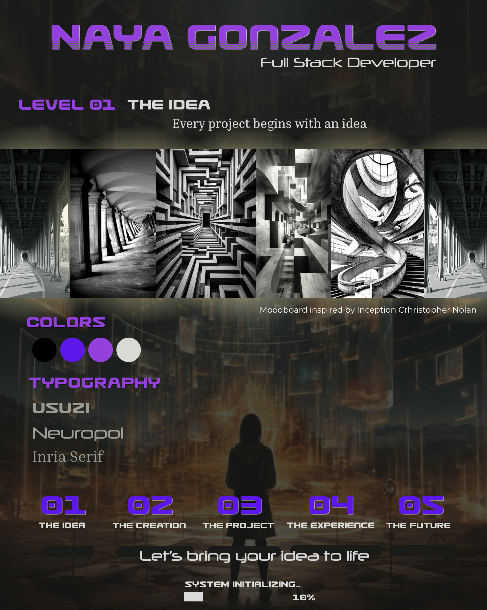

# Nayant González — Portafolio

## Concepto

Mi portafolio está inspirado en la película Inception (El origen), tomando como referencia conceptos como los niveles de sueño, implantar las ideas, la perspectiva y la transformación. (no encontre portafolios que me inspiraran por eso elegí este concepto)

La idea principal es representar cómo una idea puede convertirse en código y posteriormente en una experiencia digital.

"Every great project starts with an idea."

# Identidad visual

La identidad visual está basada en una estética oscura y cinematográfica.

Paleta de colores:

Negro #09090B
Morado #7C3AED
Fucsia #E11D8D
Gris claro #D4D4D8

# Tipografías:

Usuzi
Neuropol
Inria Serif

# Tecnologías

HTML5
CSS
Bootstrap
Git
GitHub

# Secciones

Home
the idea
the creation
Projects
Experience
The Future

## Moodboard

